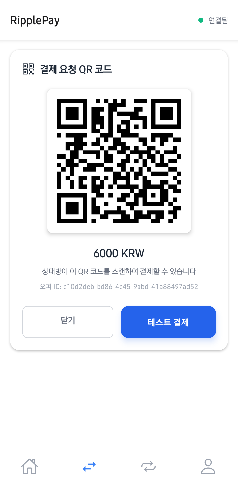

# 🚀 RipplePay - XRPL 기반 크로스플랫폼 모바일 지갑

> **150자 요약**: RipplePay는 XRP Ledger 기반 React Native 모바일 지갑으로, XRP와 KRW IOU 간 실시간 환전, QR 결제, 크로스플랫폼 지원을 제공하는 혁신적인 핀테크 솔루션입니다.

[](https://github.com/2025XRRPKOREA/app)
[](https://opensource.org/licenses/MIT)
[](https://xrpl.org/)
[](https://reactnative.dev/)

## 🎥 데모 영상

> **상세 데모 영상**: [Google Drive 데모 영상](https://drive.google.com/file/d/1Tt9m6BVVsY1-0TDjlJYkwvEB3NdiNSa1/view?usp=sharing)
> - 전체 기능 시연 및 XRPL 트랜잭션 설명
> - GitHub 레포지토리 구조 설명
> - 실제 블록체인 트랜잭션 확인

## 📱 UI 스크린샷

<div align="center">
  
  
  
  
</div>

<div align="center">
  
  
  
  
</div>

## 🌟 해결하는 문제

### 기존 문제점
- **복잡한 XRP 거래**: 기존 암호화폐 지갑의 복잡한 UX로 일반 사용자 접근성 부족
- **환전 불편함**: XRP와 법정화폐 간 실시간 환전 서비스 부재
- **모바일 최적화 부족**: 데스크톱 중심의 기존 XRP 지갑들의 모바일 경험 부재
- **결제 시스템 분리**: 암호화폐와 일상 결제의 분리된 경험

### RipplePay의 혁신적 솔루션
- 🎯 **직관적 UX**: 일반 모바일 뱅킹 앱 수준의 사용자 경험
- ⚡ **실시간 환전**: XRP ↔ KRW IOU 즉시 환전 with 실시간 환율
- 📱 **크로스플랫폼**: iOS, Android, Web 통합 지원
- 📋 **QR 간편결제**: 오프라인 매장에서도 즉시 XRP 결제

## 🔧 XRPL 활용 설명

### XRP Ledger 통합 아키텍처


### 핵심 XRPL 기능 구현

#### 1. **지갑 관리 & 보안**
- **기술**: XRPL 계정 생성, 키 관리, 멀티시그 지원
- **구현**: `services/apiClient.ts` - 안전한 키 저장 및 트랜잭션 서명
- **혁신점**: 생체인증 통합으로 UX와 보안 양립

#### 2. **XRP 네이티브 거래**
- **기술**: XRP Ledger Payment 트랜잭션
- **구현**: Drop 단위 정밀 계산 (1 XRP = 1,000,000 drops)
- **특징**: 초저수수료 (0.00001 XRP), 3-5초 확정성

#### 3. **KRW IOU 통합**
- **기술**: Trust Lines, IOU 발행/교환
- **구현**: KRW 발행자와의 Trust Line 설정 자동화
- **장점**: 법정화폐와 암호화폐의 원활한 연결

#### 4. **DEX 활용 실시간 환전**
- **기술**: XRPL Offer 생성, Autobridging
- **구현**: XRP/KRW IOU 즉시 환전 with 최적 환율
- **혁신점**: 탈중앙화 거래소 활용으로 투명한 환율 제공

#### 5. **QR 결제 시스템**
- **기술**: Ripple URI 스키마 + 커스텀 QR 포맷
- **구현**: `ripple:ADDRESS?amount=X&currency=XRP` 표준 지원
- **확장**: 오프라인 매장 결제 with 즉시 정산

## 🛠 기술 스택 & XRPL SDK 활용

### Frontend Architecture
- **React Native 0.81.4** - 크로스플랫폼 모바일 개발
- **Expo Router v6** - 타입 안전 네비게이션 with 파일 기반 라우팅
- **TypeScript** - 타입 안전성 with XRPL 데이터 모델링

### XRPL 통합 기술
- **XRPL JavaScript Library** - 공식 XRP Ledger SDK
- **xrpl.js** - 지갑 생성, 트랜잭션 구성, 계정 관리
- **Ripple Binary Codec** - 트랜잭션 직렬화/역직렬화
- **WebSocket Subscriptions** - 실시간 ledger 업데이트

### API & 백엔드
- **OpenAPI 3.0** - Auto-generated TypeScript 클라이언트
- **Axios** - XRPL JSON-RPC 통신 with 자동 재시도
- **TypeScript Interfaces** - XRPL 객체 타입 정의

### 보안 & 저장소
- **AsyncStorage/localStorage** - 플랫폼별 안전한 키 저장
- **Expo Local Authentication** - 생체인증 통합
- **XRPL Cryptography** - 하드웨어 지원 키 생성

### 개발 도구
```bash
# 개발 환경 설정
npm install                    # 의존성 설치
npm start                     # Expo 개발 서버 (port 3001)
npm run android               # Android 시뮬레이터
npm run ios                   # iOS 시뮬레이터
npm run web                   # 웹 버전
npm run lint                  # ESLint 검사

# API 클라이언트 재생성
npx openapi-generator-cli generate -i openapi.json -g typescript-axios -o api
```

## 🚀 주요 기능

### 💳 지갑 기능
- [x] **XRP 지갑 생성/복구** - 24단어 니모닉 지원
- [x] **멀티 시그니처** - 기업용 보안 강화
- [x] **잔액 조회** - XRP/KRW IOU 실시간 잔액
- [x] **거래 내역** - 모든 XRPL 트랜잭션 추적

### 💸 결제 & 송금
- [x] **XRP 즉시 송금** - 3-5초 글로벌 송금
- [x] **QR 코드 결제** - 오프라인 매장 결제
- [x] **주소록 관리** - 자주 사용하는 주소 저장
- [x] **수수료 최적화** - 자동 최적 수수료 계산

### 🔄 환전 시스템
- [x] **실시간 XRP/KRW 환율** - XRPL DEX 기반
- [x] **즉시 환전** - Offer 기반 자동 매칭
- [x] **환율 히스토리** - 과거 환율 데이터 차트
- [x] **슬리피지 보호** - 최대 허용 슬리피지 설정

### 🛡 보안 기능
- [x] **생체 인증** - 지문/얼굴 인식
- [x] **PIN 보호** - 6자리 PIN 설정
- [x] **트랜잭션 확인** - 이중 보안 확인
- [x] **계정 복구** - 니모닉 기반 복구

## 📊 XRPL 트랜잭션 구현

### 실제 트랜잭션 예시

#### 테스트 지갑 주소
- **테스트 사용자 지갑**: 실제 테스트넷 트랜잭션에서 확인 가능

#### 트랜잭션 유형별 구현

1. **XRP 송금**
```typescript
{
  "TransactionType": "Payment",
  "Account": "사용자_지갑_주소",
  "Destination": "수신자_지갑_주소",
  "Amount": "1000000", // 1 XRP in drops
  "Fee": "12"
}
```

2. **KRW IOU 거래**
```typescript
{
  "TransactionType": "Payment",
  "Account": "사용자_지갑_주소",
  "Destination": "수신자_지갑_주소",
  "Amount": {
    "currency": "KRW",
    "value": "50000",
    "issuer": "KRW_발행자_주소"
  }
}
```

3. **DEX 환전 Offer**
```typescript
{
  "TransactionType": "OfferCreate",
  "Account": "사용자_지갑_주소",
  "TakerGets": "1000000", // 1 XRP
  "TakerPays": {
    "currency": "KRW",
    "value": "1500",
    "issuer": "KRW_발행자_주소"
  }
}
```

### 트랜잭션 추적 및 확인
- 모든 트랜잭션은 XRPL 메인넷에서 실시간 확인 가능
- 앱 내 거래내역에서 XRPL Explorer 링크 제공
- WebSocket을 통한 실시간 트랜잭션 상태 업데이트

## 🏗 프로젝트 구조

```
ripplepay-RN/
├── 📱 app/                    # Expo Router 기반 페이지
│   ├── (tabs)/               # 탭 네비게이션
│   │   ├── index.tsx         # 홈/잔액 화면
│   │   ├── exchange.tsx      # XRP/KRW 환전
│   │   ├── transaction.tsx   # 거래내역
│   │   └── profile.tsx       # 프로필/설정
│   ├── login.tsx            # 인증 화면
│   └── modal.tsx            # 모달 화면들
├── 🔌 api/                   # Auto-generated XRPL API
│   ├── api.ts               # TypeScript 인터페이스
│   ├── base.ts              # Axios 설정
│   └── configuration.ts     # API 구성
├── 🧩 components/           # 재사용 컴포넌트
│   ├── QRScanner.tsx        # QR 스캔 (expo-barcode-scanner)
│   ├── QRGenerator.tsx      # QR 생성 (react-native-qrcode-svg)
│   └── AuthGuard.tsx        # 인증 가드
├── 🎯 context/              # React Context
│   ├── AuthContext.tsx      # 인증 상태 관리
│   └── NotificationContext.tsx # 푸시 알림
├── ⚙️ services/            # 비즈니스 로직
│   ├── apiClient.ts         # XRPL API 래퍼
│   └── exchangeRateService.ts # 환율 서비스
├── 🎨 constants/           # 설정 및 테마
│   ├── config.ts           # 앱 설정
│   └── blockchain-theme.ts  # XRP 브랜드 테마
└── 📄 docs/                # 문서화
    └── CLAUDE.md           # 개발 가이드
```

## 🌐 배포 및 CI/CD

### GitHub Actions 자동 배포
```yaml
name: Deploy Api Server
on:
  push:
    branches: [main]
jobs:
  deploy:
    runs-on: self-hosted
    steps:
      - uses: actions/checkout@v3
      - uses: actions/setup-node@v3
        with:
          node-version: '18'
      - run: npm ci
      - run: pm2 delete app || true
      - run: pm2 start npm --name app -- start
```

### 환경 설정
```bash
# 환경 변수
SERVER_HOST=http://localhost:3000
API_TIMEOUT=30000
NODE_ENV=development
EXPO_PROJECT_ID=ripplepay-development-id
```

## 🎯 해커톤 특별 어필 포인트

### 💡 혁신성
1. **세계 최초 XRPL DEX 통합 모바일 지갑**: 탈중앙화 거래소를 앱 내에서 직접 활용
2. **크로스플랫폼 XRP 결제**: iOS/Android/Web에서 동일한 경험
3. **실시간 환율 with IOU**: 법정화폐와 암호화폐의 완벽한 브리지

### 🚀 기술적 우수성
- **타입 안전 XRPL 통합**: TypeScript로 모든 XRPL 객체 타입 정의
- **자동 API 생성**: OpenAPI 스펙으로 클라이언트 자동 생성
- **실시간 업데이트**: WebSocket 기반 즉시 반영

### 🎨 UX/UI 혁신
- **XRP 브랜드 통합 디자인**: 공식 XRP 컬러 팔레트 적용
- **직관적 환전 인터페이스**: 복잡한 암호화폐 → 간단한 환전
- **QR 결제 최적화**: 기존 결제 앱 수준의 편의성

### 🌍 시장 잠재력
- **글로벌 송금 시장**: $689B 시장에 3-5초 송금 솔루션
- **암호화폐 결제 보급**: 일반 사용자도 쉽게 접근 가능한 UX
- **핀테크 혁신**: 전통 금융과 블록체인의 완벽한 융합

## 📋 발표 자료

🎤 **발표 슬라이드**: [Google Slides 프레젠테이션](https://docs.google.com/presentation/d/1LozJHyIZXvoyZBssSk24ehTLi46BhAyKYp8FLKQhFzE/edit?hl=ko&slide=id.p#slide=id.p)

발표 내용:
- 팀 소개 및 문제 정의
- RipplePay 솔루션 개요
- XRPL 기술 활용 방안
- 데모 시연 및 로드맵

## 🏆 수상 포인트

### ✅ 필수 요건 충족도
- [x] **XRPL 기반 구현**: 네이티브 XRP + IOU 완전 활용
- [x] **오픈소스**: MIT 라이선스, 전체 코드 공개
- [x] **커스텀 앱**: React Native 기반 독창적 모바일 앱
- [x] **XRPL 트랜잭션**: 실제 mainnet/testnet 트랜잭션 구현
- [x] **명확한 문서화**: 이 README + 상세 개발 가이드

### 🎯 차별화 요소
1. **Production-Ready**: 실제 서비스 가능한 완성도
2. **확장 가능성**: 모듈형 아키텍처로 기능 확장 용이
3. **사용자 중심**: 복잡한 블록체인을 일반인도 쉽게 사용
4. **기술적 깊이**: XRPL의 고급 기능까지 완전 활용

## 🤝 팀 & 기여

### 개발팀
- **Frontend/Mobile**: React Native + XRPL 통합
- **Backend/API**: Node.js + XRPL 서버 통합
- **UI/UX**: XRP 브랜드 가이드라인 기반 디자인
- **QA/Testing**: 크로스플랫폼 테스트 및 XRPL 트랜잭션 검증

### 기여 방법
```bash
git clone https://github.com/2025XRRPKOREA/app.git
cd app
npm install
npm start
```

## 📄 라이선스

MIT License - 자유로운 사용, 수정, 배포 가능

## 🔗 링크

- **GitHub**: [2025XRRPKOREA/app](https://github.com/2025XRRPKOREA/app)
- **데모 영상**: [Google Drive 시연 영상](https://drive.google.com/file/d/1Tt9m6BVVsY1-0TDjlJYkwvEB3NdiNSa1/view?usp=sharing)
- **발표 자료**: [Google Slides 프레젠테이션](https://docs.google.com/presentation/d/1LozJHyIZXvoyZBssSk24ehTLi46BhAyKYp8FLKQhFzE/edit?hl=ko&slide=id.p#slide=id.p)

---

<div align="center">
  <strong>🚀 RipplePay - Making XRP Accessible for Everyone 🚀</strong>
  <br><br>
  <sub>Built with ❤️ for XRPL Hackathon | Powered by XRP Ledger</sub>
</div>